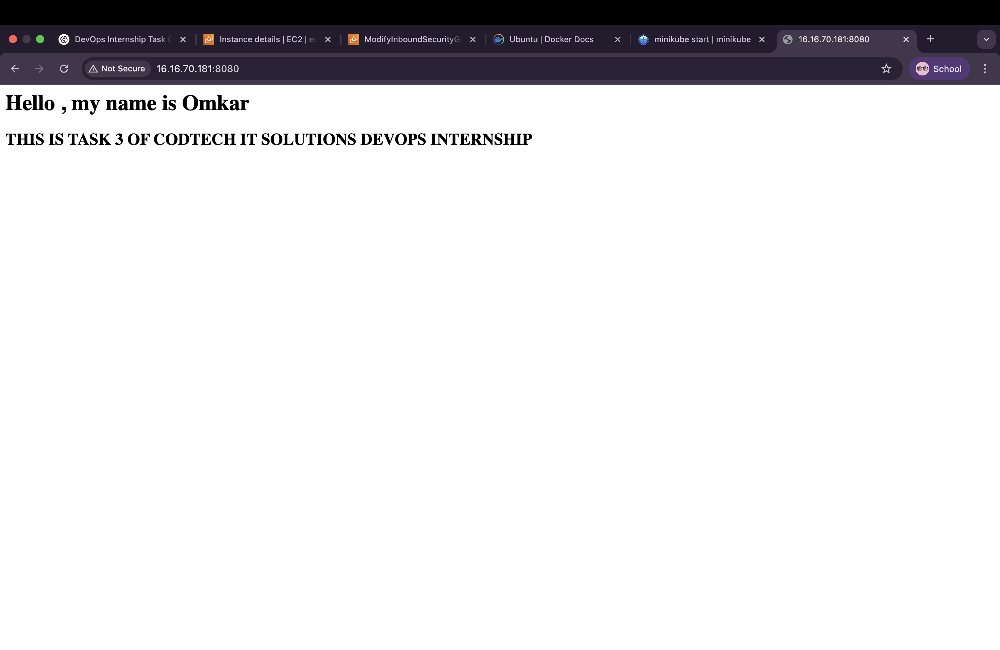

# CODTECH-TASK-3  
# KUBERNETES DEPLOYMENT OF MICROSERVICES APP  

**COMPANY**: CODTECH IT SOLUTIONS  
**NAME**: OMKAR RAJENDRA PATIL  
**INTERN ID**: CT08DM1418  
**DOMAIN**: DevOps  
**DURATION**: 8 WEEKS  
**MENTOR**: NEELA SANTOSH KUMAR  

---

## DESCRIPTION OF TASK

In this task, I deployed a simple microservice using Kubernetes on an AWS EC2 instance running Ubuntu. I installed Minikube and Kubernetes tools (`kubectl`) on the EC2 instance to simulate a local cluster.

As part of the deployment, I used Nginx as the containerized service. First, I created a pod definition in `nginx-pod.yaml`, which runs an `nginx:latest` image exposing port 80. Then, I exposed this pod using a NodePort service defined in `nginx-service.yaml` that maps to port 30080.

To verify deployment, I checked the pod and service using `kubectl get pods` and `kubectl get svc`. I then forwarded the Nginx service to port 8080 of the EC2 instance using `kubectl port-forward`, making it accessible from my browser using the public EC2 IP (`http://<public-ip>:8080`).

I also modified the Nginx HTML page by executing into the pod using `kubectl exec`, and updated the welcome page with a personalized message.

This task helped me understand the deployment of containerized applications using YAML manifests, service exposure methods, port forwarding, and accessing pods from outside the Kubernetes cluster.

---

## OUTPUT

- ✅ Deployed `nginx-pod` using `nginx:latest`
- ✅ Exposed service on NodePort (`30080`)
- ✅ Verified service via browser using port forwarding
- ✅ Custom Nginx HTML page shown in browser
- ✅ Pod and service correctly running on EC2 + Minikube

---

## FILES INCLUDED

- `nginx-pod.yaml` — Pod definition using nginx
- `nginx-service.yaml` — NodePort service for external access
- `assets/` — Screenshots of terminal and browser output

---

## 📸 SCREENSHOTS

> Make sure these images are placed in the `assets/` folder.

### 🔹 Pod & Service Created  


### 🔹 Custom HTML in Browser  

---

## HOW TO RUN

1. Apply pod and service:
    ```bash
    kubectl apply -f nginx-pod.yaml
    kubectl apply -f nginx-service.yaml
    ```

2. Forward port (from EC2):
    ```bash
    kubectl port-forward pod/nginx-pod 8080:80 --address=0.0.0.0
    ```

3. Access in browser:
    ```
    http://<your-ec2-public-ip>:8080
    ```

4. Edit welcome page:
    ```bash
    kubectl exec -it nginx-pod -- bash
    echo "<h1>Hello, my name is Omkar</h1>" > /usr/share/nginx/html/index.html
    ```

